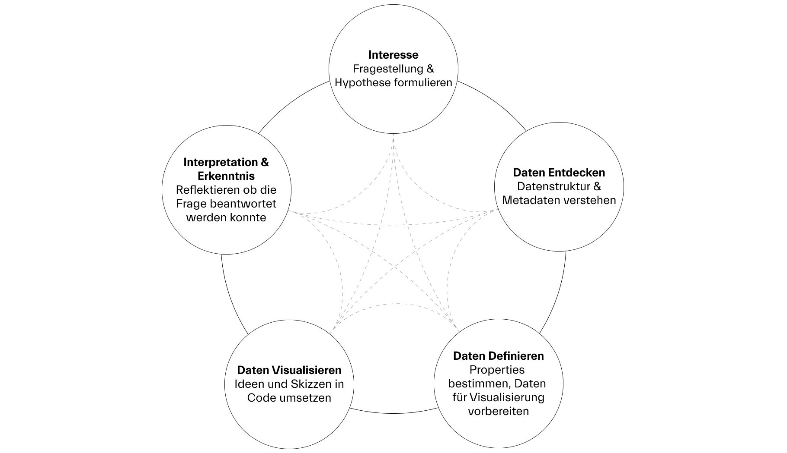

# Share 1 / Code Lab

Repository für das «Code Lab» im Modul Share 1 mit Max Frischknecht, 8.-29. Januar 2024, HSLU Data Design + Art

---

Liebe Studierende, frohes neues Jahr! 🎉

Im «Share 1 / Code Lab» programmieren wir Datenvisualisierungen mit P5 um uns weiter im Umgang mit Creative Coding und Generativer Gestaltung zu üben. Neu werden wir erstmals mit Daten von einer [API (Application Programming Interface)](https://de.wikipedia.org/wiki/Programmierschnittstelle) arbeiten. Wir nutzen dazu die öffentlich zugängliche [API des Victoria and Albert Museums](https://developers.vam.ac.uk/guide/v2/welcome.html) welche Daten zu hunderttausenden Kunstwerken enthält. Dadurch kommen wir erstmals in leichten Kontakt mit «Big Data».

**Im Zentrum steht dabei die Explorative Datenvisualisierung und eure Reflektion über den Prozess**: Ihr überlegt euch alleine oder zu zweit einen Aspekt, der euch an der Sammlung des Museums interessiert. Mithilfe der API und Visualisierungen versucht ihr mehr herauszufinden und eure Fragen zu beantworten. Dabei geht es nicht darum fix fertige Visualisierungen zu programmieren, versucht mit dem Code zu skizzieren und Erkenntnissen zu generieren, gerne auch mehrmals und auf unterschiedliche Weise. (Ihr dürft also den linearen Prozess von Entwurf und Umsetzung einmal über Bord werfen.) In relativ kurzer Zeit durchläuft ihr dadurch einmal den ganzen Prozess einer Explorativen Datenvisualisierung und lernt wie sich euer Interesse, die Daten die zur Verfügung stehen, eure Visualisierung, Coding-Skills und das Wissen welches ihr gewinnt sich gegenseitig beeinflussen. 

## Ablauf

### Erster Halbtag (8.1.) – Fokus Daten

**Interesse formulieren**

- Formuliert euer Interesse an der Sammlung in Form einer Frage (und ev. Hypothese). **Bleibt dabei simpel – die Zeit ist beschränkt.** Versucht immer festzuhalten, wenn sich euer Interesse über Zeit verändert und wieso (bspw. wenn sich die Frage auf Grund der Daten nicht beantworten lässt, aus Gründen nicht repräsentativ ist, o.ä.). Haltet diese Gedanken im mitgeschickten Dokument *Dokumentation Share 1 Code Lab* fest.
- Als Inspiration könnt ihr euch auch einige der von [V&A publizierten Beispiele](https://developers.vam.ac.uk/notebooks/data-explorations/intro.html) anschauen.

**Daten entdecken & definieren**

- Versucht zu verstehen, wie die Sammlung entstanden ist. Ev. ist es nötig dazu auch etwas über das Museum und seine Geschichte zu recherchieren. Gibt es ein Bias in den Daten, sind bspw. Werke aus einer bestimmten Zeit oder Region besonders häufig vertreten? Haltet eure Beobachtungen in Stichworten fest.  
- Schaut euch die [Sammlung](https://www.vam.ac.uk/collections?type=featured) über die Webseite an um ein Gefühl für Daten zu kriegen.
- Schaut euch die API-Dokumentation an um zu verstehen welche Properties es gibt. Wichtig sind hier der [Quick Start](https://developers.vam.ac.uk/guide/v2/quick-start.html) sowie die Introductions zu [Searching](https://developers.vam.ac.uk/guide/v2/search/introduction.html#searching-top), [Filtering](https://developers.vam.ac.uk/guide/v2/filter/introduction.html) sowie [Clustering](https://developers.vam.ac.uk/guide/v2/data-vis/clustering.html#clustering-top). Welche Möglichkeiten bieten sich dadurch für Visualisierungen? (bspw. Zeitliche, räumliche oder andere Darstellungen). Ihr könnt dazu auch den bereitgestellten Sketch nutzen um via `console.log`einen Eindruck von den Daten und ihrer Struktur zu erhalten. Natürlich dürft ihr auch dazu auch kleine Handskizzen anfertigen, um Ideen festzuhalten. 
- Durch eine Suche auf der Webseite, bspw. nach der Kategorie `Feminism`, findet ihr die benötigten Identifiers heraus um einen API Query zu schreiben (Schaut dazu in die Browser [URL](https://collections.vam.ac.uk/search/?id_category=THES48955)).

**Ziel** 

- Entscheidet euch bis zum Mittag für eine zentrale Data-Property mit welcher ihr für den Rest des Unterrichts arbeitet. Überlegt euch allenfalls, welche anderen Properties für spannende Vergleiche in Frage kommen (bspw. könnt ihr Orte untersuchen und herausfinden welche Tags ihr dazu findet oder in welchen Jahren Kunstwerke entstanden sind). Haltet eure Gedanken und Entscheide in Stichworten im Dokument *Dokumentation Share 1 Code Lab* fest.

### Zweiter & Dritter Halbtag (15. & 22.1.) – Fokus Explorative Datenvisualisierung

**Daten Visualisieren**

- Entwickelt Skizzen und Ideen was visualisiert werden soll. Diese können sehr grob sein, und dienen euch vor allem dazu eine grobe Idee zu haben, bevor ihr in den Code startet. Behaltet dabei die Programmierung im Hinterkopf und wählt im Zweifelsfall eine simplere Variante, wo ihr wisst wie man sie umsetzen kann.
- Falls ihr in einer Gruppe arbeitet, könnt ihr selbst entscheiden, ob ihr die Visualisierung gemeinsam macht oder individuell.
- Wechselt schnell in P5 und versucht basierend auf dem Starter Template erste Versuche der Visualisierung zu programmieren.
- Es ist natürlich auch erlaubt mehrere Code-Sketches zu machen.
- Beobachten dabei wie sich durch die Visualisierung und das Coding euer Erkenntnissinteresse verändert, weiterentwickelt und verschiebt.

**Ziel** 

- Ihr habt bis zum 22.1. eine oder mehrere kleine Visualisierungen in P5 programmiert welche mithilfe der API Daten eure Frage beantworten oder einer Antwort näher kommen. Ihr haltet dabei Gedanken, Erkenntnisse, Probleme in Stichworten fest.

### Vierter Halbtag (29.1.) – Abschluss & Abgabe

- Der letzte halbe Tag dient dazu letzte Anpassungen im Code zu machen und die Abgabe zu machen.

## Abgabe 

- Exportiert eure Visualisierung als JPG
- Legt den finalen Code in einem Ordner ab
- Gebt das Dokument *Dokumentation Share 1 Code Lab* mit euren Gedanken und Stichworten ab

## Material

- `starter_template` mit P5js Code
- Dokument "Dokumentation" zum Festhalten eurer Gedanken und Schritte mit vorgegebener Struktur
